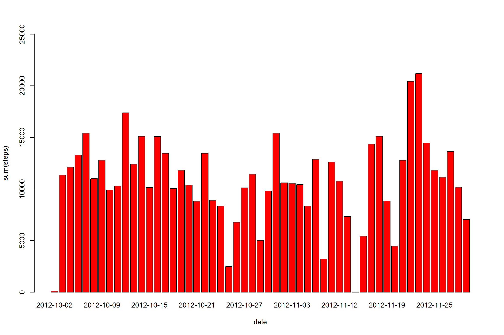
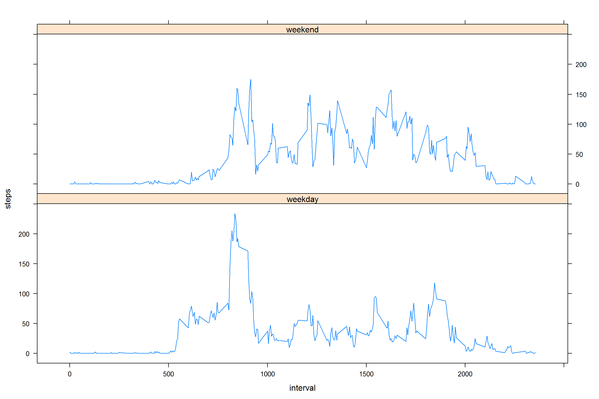

    knitr::opts_chunk$set(fig.width=12, fig.height=8, fig.path='Figs/',
                          echo=TRUE, warning=FALSE, message=FALSE)

    library(knitr)
    library(dplyr)
    library(ggplot2)
    library(lattice)

    # Loading Data

    activity <- read.csv("D:/RCoursera/Reproducible Research/Week1/Data/activity.csv", colClass=c('integer', 'Date', 'integer'))

    # What is mean total number of steps taken per day?

    steps.date <- aggregate(steps ~ date, activity, sum)

    head(steps.date)

    ##         date steps
    ## 1 2012-10-02   126
    ## 2 2012-10-03 11352
    ## 3 2012-10-04 12116
    ## 4 2012-10-05 13294
    ## 5 2012-10-06 15420
    ## 6 2012-10-07 11015

    barplot(steps.date$steps, names.arg=steps.date$date, ylim=c(0, 25000), xlab="date", ylab="sum(steps)",col='Red')

<!-- -->

    mean(steps.date$steps)

    ## [1] 10766.19

    median(steps.date$steps)

    ## [1] 10765

    # What is the average daily activity pattern?

    steps.interval <- aggregate(steps ~ interval, activity, mean)
    plot(steps.interval, type='l', col = 'blue')

<!-- -->

    maxvalue <- steps.interval$interval[which.max(steps.interval$steps)]
    maxvalue

    ## [1] 835

    # Imputing missing values

    sum(is.na(activity$steps))

    ## [1] 2304

    activity.clean <- merge(activity, steps.date, by="date", suffixes=c("", ".mean"))

    nas <- is.na(activity.clean$steps)
    activity.clean$steps[nas] <- activity.clean$steps.mean[nas]
    activity.clean <- activity.clean[, c(1:3)]
    head(activity.clean)

    ##         date steps interval
    ## 1 2012-10-02     0     1740
    ## 2 2012-10-02     0     1715
    ## 3 2012-10-02     0     1725
    ## 4 2012-10-02     0     1710
    ## 5 2012-10-02     0     1735
    ## 6 2012-10-02     0     1855

    steps.date <- aggregate(steps ~ date, activity.clean, sum)

    barplot(steps.date$steps, names.arg=steps.date$date, ylim=c(0, 25000), xlab="date", ylab="sum(steps)",col = 'blue')

<!-- -->

    # Mean & Median

    mean(steps.date$steps)

    ## [1] 10766.19

    median(steps.date$steps)

    ## [1] 10765

    # Are there differences in activity patterns between weekdays and weekends?

    day <- function(dates) {
      f <- function(date) {
        if (weekdays(date) %in% c("Saturday", "Sunday")) {
          "weekend"
        }
        else {
          "weekday"
        }
      }
      sapply(dates, f)
    }

    activity$day <- as.factor(day(activity$date))
    str(activity)

    ## 'data.frame':    17568 obs. of  4 variables:
    ##  $ steps   : int  NA NA NA NA NA NA NA NA NA NA ...
    ##  $ date    : Date, format: "2012-10-01" "2012-10-01" ...
    ##  $ interval: int  0 5 10 15 20 25 30 35 40 45 ...
    ##  $ day     : Factor w/ 2 levels "weekday","weekend": 1 1 1 1 1 1 1 1 1 1 ...

    steps.interval <- aggregate(steps ~ interval + day, activity, mean)
    xyplot(steps ~ interval | day, data=steps.interval, layout=c(1,2), type='l')

<!-- -->
